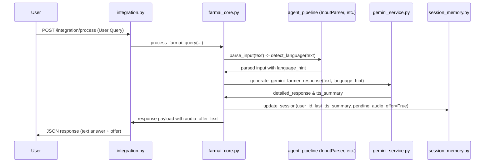

# FarmAI Audio and Language Pipeline Audit

This audit documents the current architectural flow of text input, language detection, Speech-to-Text (STT), Text-to-Speech (TTS), and user session persistence in the FarmAI project. It outlines the safety plan for subsequently introducing Punjabi and Siraiki languages.

---

## A. Current Text Query Flow

1. **User Request**: When a user sends a text query, the request is received by the gateway and posted to the `/integration/process` (or `/integration/process-upload`) endpoint in [integration.py](file:///c:/mehruLaibaAliIsa@librariesDeployment/backend/routers/integration.py).
2. **Core processing**: The endpoint invokes the `process_farmai_query()` function in [farmai_core.py](file:///c:/mehruLaibaAliIsa@librariesDeployment/backend/services/farmai_core.py).
3. **Language Detection**: Within `process_farmai_query()`, the input is parsed by `parse_input()` from [input_parser.py](file:///c:/mehruLaibaAliIsa@librariesDeployment/backend/agents/input_parser.py). It detects the language using `detect_language(text)` from [helpers.py](file:///c:/mehruLaibaAliIsa@librariesDeployment/backend/utils/helpers.py).
4. **Farmer Response Generation**: The sequential 7-agent pipeline runs, ending with `OutcomeAgent` formatting the response. `gemini_service.py` is called to generate the structured JSON containing `detailed_response` and `tts_summary`.
5. **Saving Summary & Offer**: `tts_summary` is fetched, and the session is updated with `pending_audio_offer: True` and `last_tts_summary: tts_summary` via `update_session()` in [session_memory.py](file:///c:/mehruLaibaAliIsa@librariesDeployment/backend/services/session_memory.py).

---

## B. Current Urdu Text Flow
* **Detection**: Typing in Urdu script is detected explicitly using `re.search(r"[\u0600-\u06FF]", text)` in `detect_language()`, which returns `"urdu"`.
* **Language Hint Propagation**: The `language_hint` is mapped to `"ur"` and propagated to the prompt construction, validation, summary generation, and TTS services.
* **Gemini Instructions**: Prompts in `generate_gemini_farmer_response()` in [gemini_service.py](file:///c:/mehruLaibaAliIsa@librariesDeployment/backend/services/gemini_service.py) enforce strict constraints for Urdu:
  > The user has written in Urdu script. You MUST reply ONLY in Urdu script. Do NOT use Latin/English characters...
* **Formatting Control**: Controlled by the `system_prompt` (defining headings map: `ممکنہ مسئلہ:`, `خطرے کی سطح:`, `تجویز کردہ عمل:`, etc.) and verified by `_validate_response()` in `gemini_service.py` (which checks for at least 15/40 Urdu characters, lack of English characters, and presence of all required Urdu heading lines).

---

## C. Current Voice/STT Flow
* **Endpoint**: Voice requests are handled by `POST /voice-analyze` in [voice.py](file:///c:/mehruLaibaAliIsa@librariesDeployment/backend/routers/voice.py).
* **Service File**: [stt_service.py](file:///c:/mehruLaibaAliIsa@librariesDeployment/backend/services/stt_service.py) performs STT via the `transcribe_audio()` function.
* **Model/Provider**: Gemini API (`GenerativeModel`) is configured with the uploaded audio file part and system prompt. It auto-discovers/uses models like `models/gemini-2.5-flash` or `models/gemini-2.0-flash`.
* **STT Return value**: Returns a dictionary: `{"success": bool, "transcript": str, "language_hint": str, "error_type": str, "model_used": str}`.
* **Transcription Routing**: The transcribed text is sent to the same standard agent pipeline using `parse_input(text=transcript, ...)` in [voice.py](file:///c:/mehruLaibaAliIsa@librariesDeployment/backend/routers/voice.py).
* **Language Storage**: The detected language is stored in `parsed["language_hint"]`. In the `/voice-analyze` route, TTS is invoked immediately on the output summary without asking for "haan" confirmation.

---

## D. Current TTS Flow
* **Endpoints**: Standing `/tts` route in [tts.py](file:///c:/mehruLaibaAliIsa@librariesDeployment/backend/routers/tts.py).
* **Service File**: [tts_service.py](file:///c:/mehruLaibaAliIsa@librariesDeployment/backend/services/tts_service.py) via `generate_tts_audio(text, language_hint)`.
* **Language Hints Supported**: `"ur"`, `"urdu"`, `"roman_urdu"`, `"en"`, `"english"`.
* **Model/Voice Configuration**:
  - **Model**: Uses model configured in `GEMINI_TTS_MODEL` (e.g. `gemini-2.5-flash-preview-tts`), falling back to priority models list and available TTS models containing `"tts"` (tries up to 3 candidates).
  - **Voice/Speaker**: Pre-configured as a constant `DEFAULT_VOICE = "Aoede"` inside [tts_service.py](file:///c:/mehruLaibaAliIsa@librariesDeployment/backend/services/tts_service.py).
* **Output Path**: Standard WAV files are created first using `pcm_to_wav()` and saved under `backend/static/audio/`.
* **URL Building**: Constructed dynamically as `f"{base_url}/static/audio/{filename}"` based on the incoming HTTP request metadata.

---

## E. Current Audio Confirmation Flow
1. **Summary Persistence**: When a normal text query finishes, `last_tts_summary` is saved in the session memory ([session_memory.json](file:///c:/mehruLaibaAliIsa@librariesDeployment/backend/data/session_memory.json)).
2. **Afirmative matching**: When the user replies "haan", the affirmative keywords block matches it inside `process_farmai_query()` in [farmai_core.py](file:///c:/mehruLaibaAliIsa@librariesDeployment/backend/services/farmai_core.py).
3. **Retrieving Saved Text**: Fetched using `saved_summary = session.get("last_tts_summary")` and trimmed to `350-500` characters maximum, splitting at sentence boundaries (`.`, `?`, `!`, `\n`, `\u06d4`).
4. **Language Hint Retrieval**: Read from `last_lang = session.get("last_language", "ur")`.
5. **TTS Invocation**: `generate_tts_audio(trimmed_summary, last_lang)` generates a WAV file.
6. **OGG Opus Conversion**: `convert_wav_to_ogg_opus(wav_path)` runs `ffmpeg` to encode OGG. If successful and file size > 0, it sets `whatsapp_ready: True`.
7. **URL Response**: Returns URL of the OGG file, falling back to WAV if OGG fails.

---

## F. Session Memory Keys
* **Storage backend**: JSON-file backed memory managed in [session_memory.py](file:///c:/mehruLaibaAliIsa@librariesDeployment/backend/services/session_memory.py).
* **Important keys**:
  - `"last_language"`: Tracks the language used in the last transaction (essential to know if the summary is in English, Urdu, Punjabi, Siraiki).
  - `"last_tts_summary"`: Holds the summary text used for audio generation.
  - `"pending_audio_offer"`: Tracks whether the system is waiting for an audio confirmation.
  - `"last_audio_url"`: Stores the last generated audio link.
  - `"audio_generation_status"`: Current state of audio generation (`"ready"`, `"failed"`, etc.).
* **Punjabi/Siraiki requirements**: `"last_language"` will need to correctly persist `"punjabi"` or `"siraiki"`.

---

## G. Safety Plan for Language Extension

### 1. Language Detection Points
In [helpers.py](file:///c:/mehruLaibaAliIsa@librariesDeployment/backend/utils/helpers.py):
- Expand `detect_language()` to include specific Siraiki/Punjabi characters (e.g. `ٻ`, `ڄ`, `ڳ`, `ڑ`, `ݨ`) or common vocabulary keywords (e.g., `کپاہ`, `کنک`, `میرا`, `تساڈا`, `ہاں`).

### 2. Gemini Prompts & Output Validation
In [gemini_service.py](file:///c:/mehruLaibaAliIsa@librariesDeployment/backend/services/gemini_service.py):
- In `generate_gemini_farmer_response()`: add instructions for Siraiki and Punjabi language hints, detailing the required headings map and script style.
- In `_validate_response()`: include character validation rules and required headings checks for Siraiki/Punjabi response structures to avoid language leakage.

### 3. TTS Voice/Speaker Parameters
In [tts_service.py](file:///c:/mehruLaibaAliIsa@librariesDeployment/backend/services/tts_service.py):
- Map `"punjabi"` and `"siraiki"` language hints in `_execute_tts()` to their respective prebuilt voices, settings, and pronunciation guidance instructions (e.g. setting `DEFAULT_VOICE` configurations dynamically based on `active_lang`).

---

## H. Safety Risks to Avoid
* [x] **TTS Engine Voice Pollution**: Do not modify default settings for `"ur"` or `"en"` hints; keep `DEFAULT_VOICE = "Aoede"` or mapped voice paths completely untouched when mapping new languages.
* [x] **JSON Validation Crashes**: Ensure Punjabi and Siraiki prompt systems strictly enforce standard JSON response schema structure `{"detailed_response": "...", "tts_summary": "..."}` to prevent parsing crashes in `gemini_service.py`.
* [x] **Audio Offer Failures**: Ensure `"last_language"` mapping is strictly set to `"punjabi"` or `"siraiki"` during initial analysis so that replying `"haan"` automatically routes the summary using the correct voice profile.
* [x] **RAG Constraints**: Do not alter RAG queries or documentation retrieval steps; language settings should only apply to response formatting and voice rendering layers.
