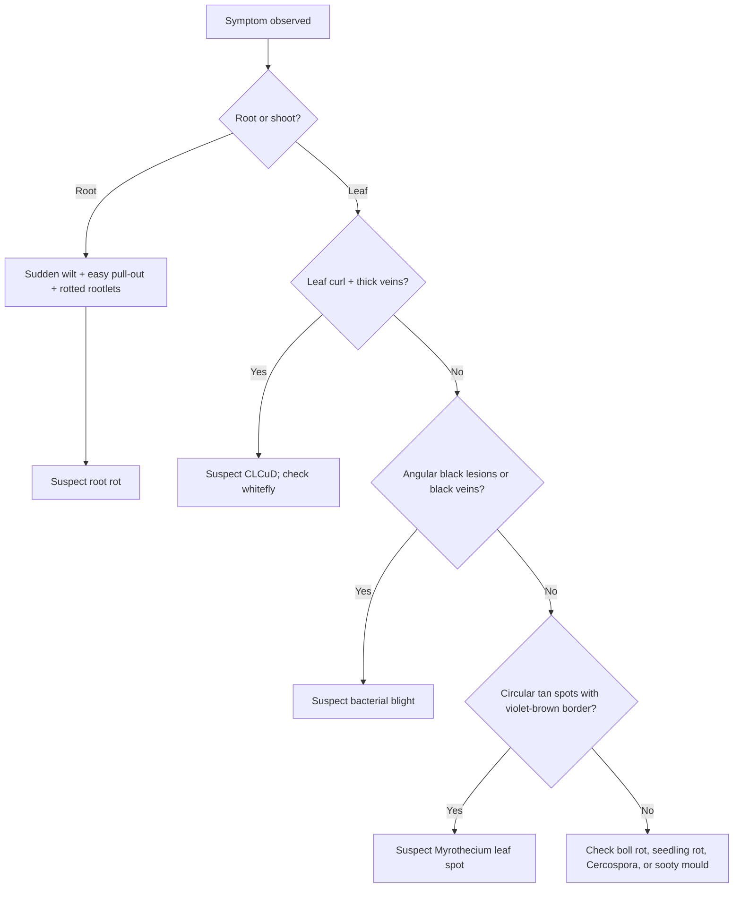

# Cotton Diseases — Punjab/Pakistan RAG Knowledge File

## Metadata
- Crop: Cotton / Kapaas / Phutti
- Region focus: Punjab, Pakistan; especially South Punjab where CCRI Multan guidance is most relevant.
- Primary uploaded sources:
  - `cotton_ccri_diseases_base.txt`
  - `cotton_ccri_clcuv_research.txt`
  - `cotton_varieties_taxonomy.txt`
  - `ccri_cotton_global_germplasm.txt`
- Supplementary official/local sources used where uploaded files did not contain enough agronomy/pest-threshold context:
  - Central Cotton Research Institute (CCRI) Multan pathology guidance
  - CCRI Multan Annual Progress Report 2023–2024
  - Pakistan Central Cotton Committee (PCCC)

## Executive Summary
Cotton disease risk in Punjab is strongly linked with infected seed, crop debris, humid weather, excessive nitrogen, excessive or late irrigation, poor aeration, whitefly pressure, weeds, and carryover hosts. The major disease complex covered here includes bacterial blight, seedling rot, boll rot, root rot, anthracnose, stunting, Myrothecium leaf spot, Cercospora leaf spot, Cotton Leaf Curl Virus/Disease (CLCuV/CLCuD), and sooty mould.

For American cotton (`Gossypium hirsutum`), treat CLCuD and sucking-insect-vector pressure as high priority. For desi cotton (`Gossypium arboreum` / `G. herbaceum`), CLCuD risk is lower, but root rot, boll rot, and other field issues still require monitoring.

## Important Disease-Risk Modifiers
- **American cotton / upland cotton** is the dominant commercial cotton type in Pakistan and is vulnerable to local pest and disease pressure, especially CLCuD.
- **Desi cotton** has stronger natural resistance/immunity to CLCuV symptoms compared with American cotton.
- Imported/exotic varieties with thinner leaves should be watched more closely for foliar diseases and sucking insects.
- High-GOT American varieties require strict nitrogen and irrigation balance; over-watering and late irrigation can worsen boll problems and maturity delay.

## Disease Identification Table

| Disease | Local/Common Names | Key Symptoms | Main Risk Factors | Field Action |
|---|---|---|---|---|
| Bacterial blight | Black arm, vein blight, patton ka jhulsao | Angular water-soaked leaf spots, black veins, black stem lesions, boll spots, lint staining | Infected seed, debris, rain splash, humid warm weather | Use clean seed, rotate 2–3 years, bury infected trash deeply after picking |
| Seedling rot | Beej ka galna, pauda marna | Poor emergence, weak seedlings, stunted early plants | Seedborne fungi, poor seed treatment, wet soil | Use acid-delinted and fungicide-treated seed |
| Boll rot | Tinday ka galna | Sunken/discolored bolls, internal lint/seed damage, stained fiber | Hot humid canopy, pest injury, excess N, excess water, weeds | Balance N/water, control pests, stop final irrigation early October |
| Root rot | Ukhaara, jarr ka galna | Sudden wilt, easy pull-out, rotten rootlets, shredded taproot, yellowish liquid from fresh root | Recurring infected patches, July–August peak, affected soils | Deep plough, remove stubbles, delay sowing in affected patches, use tolerant/resistant varieties |
| Anthracnose | Surkh nishan | Reddish spots on cotyledons/leaves/stems/bolls | Infected seed/debris | Certified disease-free seed, seed dressing, destroy debris |
| Stunting | Chota rehna, sookra | Slow true-leaf appearance, permanently short plants, low-vigor seed | Early-planted exotic varieties, soil/pathogen stress | Prefer locally adapted varieties or delay exotic sowing to June |
| Myrothecium leaf spot | Challe nishan | Circular tan spots with violet-brown margins and ring-like appearance | Late July onward, humidity, susceptible foliage | Confirm diagnosis; historical CCRI guidance mentions Benlate/Vitigran Blue |
| Cercospora leaf spot | Purane patton ke nishan | Older leaves with brown/purple/black borders and pale centers; shot-hole effect | Late season, mature leaves | Usually minor; often monitoring is enough |
| CLCuD / CLCuV | Patta maror, kokra | Leaf curling, vein thickening, enations on leaf underside, twisted petioles/branches | Whitefly vector, late planting, infected stubs, alternate hosts | Control whitefly, remove stubs/hosts, avoid late planting, use tolerant varieties |
| Sooty mould | Kaali ulli | Black mould on leaves/stems/flowers due to honeydew | Whitefly/aphid honeydew, late-season sucking pests | Control sucking insects; reduce honeydew source |

## Cotton Leaf Curl Disease / Virus Notes
CLCuD is one of the most important cotton threats in Pakistan. Uploaded CCRI-based material records:
- A major epidemic in Pakistan from 1992–1995.
- A major resurgence in 2001 from the Burewala/Vehari region.
- The Burewala strain broke earlier resistance in available germplasm.
- Whitefly (`Bemisia tabaci`) is the major vector.
- `Gossypium arboreum` / desi cotton is much safer against typical CLCuV symptom expression than American cotton.
- CIM-608 is highlighted in the uploaded CCRI research addendum as a high-tolerance variety evolved through CCRI breeding work.

### CLCuD Symptoms
- Upward or downward curling of leaves.
- Thickened veins, especially visible on the underside.
- Small vein thickening and main vein thickening.
- Leaf-like/cup-like enations on leaf underside.
- Twisted petioles and branches in severe infection.
- Abnormally tall main stem with elongated internodes in severe cases.

### CLCuD Prevention
- Remove previous cotton stubs.
- Destroy volunteer cotton and alternate hosts.
- Remove off-season okra and malvaceous weeds around fields/channels.
- Monitor and control whitefly early.
- Avoid late planting in high-risk areas.
- Prefer tolerant/resistant approved varieties in high-history zones.

## Bacterial Blight Management
Bacterial blight is severe in Punjab during rainy/humid periods. It spreads through infected seed, infected plant debris, drainage water, wind-driven rain, irrigation splash, tools, and insects.

### Prevention
- Use certified disease-free seed.
- Avoid uncertified seed from high-moisture disease-prone areas.
- Rotate cotton with non-host crops for 2–3 years.
- After final picking, plough infected debris deep into moist soil to speed decomposition.
- Avoid moving tools/equipment from infected wet fields to clean blocks.

## Root Rot Management
Root rot appears in recurring patches and is severe in some South Punjab areas such as Bahawalpur division.

### Field Signs
- Plants suddenly wilt and die.
- Plants pull out easily.
- Rootlets rot completely.
- Taproot becomes shredded.
- Fresh infected root may ooze yellowish liquid when pressed.

### Management
- Map affected patches.
- Deep plough.
- Remove old infected stubbles.
- Delay sowing in known affected patches to mid/end June.
- Intercrop cotton with moth bean in affected patches and do not remove moth before mid-August.
- Avoid highly susceptible varieties in root-rot patches where possible.

## Boll Rot Management
Boll rot increases under hot, humid, dense-canopy conditions. It is made worse by pest injury, excessive nitrogen, excessive irrigation, weeds, and poor air movement.

### Management
- Avoid excessive nitrogen.
- Correct irrigation timings.
- Stop final irrigation by the first week of October.
- Control late-season sucking and boring pests.
- Keep field weed-free.
- Prefer open-canopy types where suitable.
- Historical CCRI notes mention Benlate at 250 g/acre; verify current registration before use.

## Diagnostic Flow

## Monitoring
- Scout weekly from emergence.
- Intensify scouting from mid-June to end-August for whitefly and CLCuD.
- Watch root-rot patches from 7–8 weeks onward.
- Intensify boll checks during humid late-season canopy closure.
- Use pest ETLs because pests trigger or worsen several diseases:
  - Whitefly: 5 adults/nymphs or both per leaf.
  - Jassid: 1 adult/nymph per leaf.
  - Thrips: 10 adults/nymphs per leaf.
  - Pink bollworm: 5% boll damage.

## RAG Keywords
cotton disease, kapaas disease, phutti disease, bacterial blight, black arm, vein blight, seedling rot, boll rot, root rot, ukhaara, anthracnose, stunting, myrothecium leaf spot, cercospora, cotton leaf curl virus, CLCuV, CLCuD, patta maror, kokra, whitefly vector, sooty mould, Punjab cotton disease, South Punjab cotton

## Source Notes
Primary facts are from the uploaded CCRI cotton disease and CLCuV files. Supplementary local agronomy/threshold facts are from official CCRI Multan and PCCC sources. Historical chemical names are kept only as source-preserved references and should be checked against current pesticide/fungicide registration before field use.
