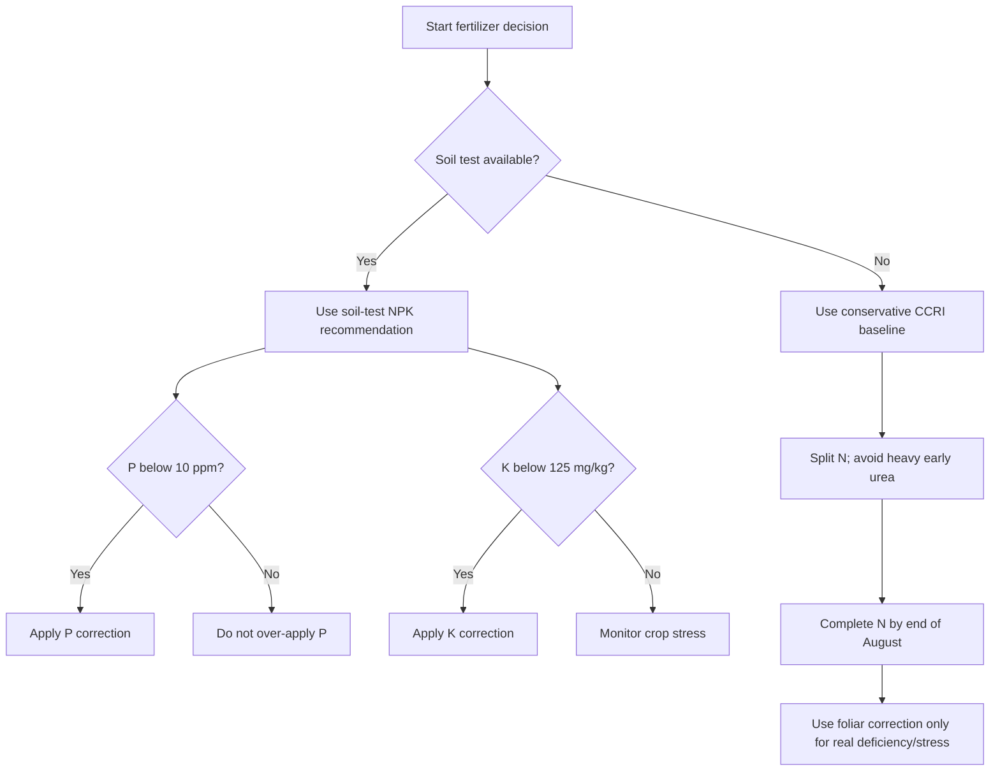

# Cotton Fertilizer — Punjab/Pakistan RAG Knowledge File

## Metadata
- Crop: Cotton / Kapaas / Phutti
- Region focus: Punjab, Pakistan
- Primary uploaded source:
  - `ccri_cotton_global_germplasm.txt`
- Supplementary official/local sources:
  - CCRI Multan agronomy guidance
  - CCRI Multan Annual Progress Report 2023–2024

## Executive Summary
Cotton fertilizer management in Punjab should be soil-test-based and stage-based. Unknown fields should not be pushed with heavy nitrogen by default because excessive nitrogen causes vegetative growth, delays maturity, attracts pests, worsens boll problems, and increases production cost.

A safe official local baseline from CCRI annual-report guidance:
- Nitrogen: 150–200 kg N/ha in normal-season cotton, split, completed by the end of August.
- Phosphorus: up to 100 kg P₂O₅/ha if available soil P is below 10 ppm.
- Potassium: 50 kg K₂O/ha if available soil K is below 125 mg/kg.
- Approximate acre equivalents:
  - Nitrogen: 61–81 kg N/acre.
  - Phosphorus: 40 kg P₂O₅/acre where soil P is low.
  - Potassium: 20 kg K₂O/acre where soil K is low.

## Important Local Soil Context
CCRI describes many cotton soils in Pakistan as:
- Calcareous
- Alkaline
- Low in organic matter

So fertilizer management should not only mean chemical fertilizer. It should include:
- Green manuring
- Farmyard manure where available
- Crop residue incorporation
- Soil testing
- Balanced NPK
- Micronutrient correction where needed

## Fertilizer Schedule

| Crop Stage | Timing | Recommended Action | Notes |
|---|---|---|---|
| Pre-sowing | Around 4 weeks before sowing | Incorporate FYM, green manure, or crop residues | Helps low organic matter soils |
| Land preparation / sowing | Day 0 | Apply all required phosphorus, conditional potassium, and about 1/4 nitrogen | Use soil test where possible |
| Early vegetative | Establishment stage | Monitor stand, leaf color, and growth | Avoid heavy early N excess |
| Flowering | First major reproductive stage | Apply next nitrogen split | Match with irrigation |
| Boll setting | Reproductive peak | Apply remaining N and split K if used | Complete N by end of August |
| After rain/stress | Recovery stage | Foliar boron + zinc, soluble potassium, magnesium, or urea only if needed | Follow official rates and label compatibility |
| Late deficiency correction | Late visible deficiency | 3% urea foliar spray if true N deficiency appears | Do not mix with insecticides as per CCRI note |

## Nutrient Deficiency Identification

| Nutrient | Symptoms | Practical Meaning | Corrective Direction |
|---|---|---|---|
| Nitrogen | Lower leaves light green/yellow, yellow stalk, stunted plants | N deficiency or poor uptake | Complete split N; late 3% urea foliar only if needed |
| Phosphorus | Dark yellow lower leaves, reddish/yellow stalk | Low available P, weak root development | Apply P based on soil test, mostly early |
| Potassium | Chlorotic/mottled necrotic spots between veins or near margins | K shortage, often worse under stress | Apply K if soil K low; foliar soluble K under stress |
| Boron/Zinc | Poor fruiting after rain/stress | Micronutrient stress | Foliar B + Zn recovery spray |
| Magnesium | General weakness/stress response | Secondary nutrient issue | Magnesium sulfate, preferably split foliar correction |

## Nitrogen Management
Nitrogen is important, but excessive nitrogen is harmful.

### Too Little Nitrogen
- Weak plants.
- Pale leaves.
- Poor fruiting.
- Low boll retention.

### Too Much Nitrogen
- Excessive vegetative growth.
- Delayed maturity.
- More pest attraction.
- Higher boll rot risk due to dense canopy.
- Higher cost without reliable yield gain.

### RAG Rule
If the farmer says “plants are very green and tall but bolls are weak,” do not recommend more urea blindly. First check:
- Irrigation excess
- Nitrogen excess
- Pest pressure
- Variety type
- Planting date
- Boll setting stage

## Phosphorus and Potassium
Phosphorus and potassium help cotton with root development, fruiting, stress tolerance, and water-stress buffering.

### Soil-Test Triggers
- If available P is below 10 ppm: apply phosphorus correction.
- If available K is below 125 mg/kg soil: apply potassium correction.

### Potash Note
Potassium is important for cotton under water stress and reproductive load. Do not omit K in soils where testing shows deficiency.

## Organic Matter and Residue Management
Before sowing:
- Incorporate green manure or crop residues about one month before planting.
- Use a small urea dose with irrigation after residue incorporation to speed decomposition.
- Avoid burning residues where incorporation is possible.
- Good residue management improves soil organic matter, phosphorus, potassium, and water behavior.

## Micronutrient and Stress Correction
After rain or stress, CCRI guidance supports:
- 3–4 foliar sprays of boron + zinc at 0.05% solution.
- 2% urea in the spray tank may improve effect where recommended.
- 2% soluble potassium spray under stress.
- Magnesium sulfate, with foliar magnesium in split doses where needed.

Always check current local advisory and label before mixing products.

## Fertilizer Decision Flow

## RAG Response Rules
- Always ask or infer crop stage.
- Prefer soil test.
- Do not blindly recommend urea.
- If pest or disease pressure is high, warn that extra nitrogen can worsen the issue.
- For imported/high-GOT American varieties, emphasize strict nitrogen scheduling.
- For late-season crops, avoid fertilizer advice that delays maturity.
- Mention local label/registration check before foliar product mixing.

## RAG Keywords
cotton fertilizer, kapaas khaad, urea cotton, DAP cotton, potash cotton, cotton NPK, phosphorus deficiency cotton, potassium deficiency cotton, nitrogen deficiency cotton, boron zinc cotton, magnesium sulfate cotton, Punjab cotton fertilizer, CCRI cotton fertilizer, cotton nutrient management

## Source Notes
Uploaded germplasm data provided variety-related nitrogen sensitivity and overwatering warnings. Fertilizer rates and timing were filled from official CCRI Multan agronomy and annual-report guidance.
