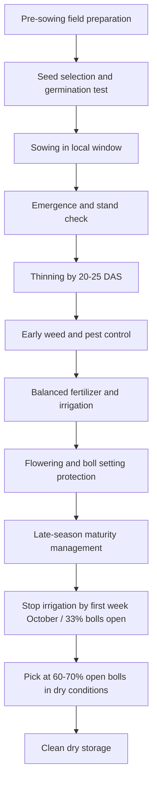

# Cotton General Care — Punjab/Pakistan RAG Knowledge File

## Metadata
- Crop: Cotton / Kapaas / Phutti
- Region focus: Punjab, Pakistan
- Primary uploaded sources:
  - `ccri_cotton_global_germplasm.txt`
  - `cotton_varieties_taxonomy.txt`
  - `cotton_ccri_clcuv_research.txt`
  - `cotton_ccri_diseases_base.txt`
- Supplementary official/local sources:
  - CCRI Multan agronomy guidance
  - CCRI Multan Annual Progress Report 2023–2024
  - PCCC

## Executive Summary
Good cotton care in Punjab starts before sowing. The most important actions are:
- Prepare well-drained, level soil.
- Improve organic matter.
- Use approved, healthy, delinted/tested seed.
- Plant in the correct local window.
- Maintain a uniform stand.
- Use bed-furrow planting where feasible.
- Thin on time.
- Control weeds early.
- Scout pests and diseases.
- Balance fertilizer and water.
- Stop late irrigation.
- Pick and store cotton carefully to preserve lint quality.

## Soil and Field Preparation
CCRI guidance describes many cotton soils in Pakistan as calcareous, alkaline, and low in organic matter. A good cotton field should be:
- Well-drained
- Loamy where possible
- Properly leveled
- Free of hardpan where roots are restricted
- Free from undecomposed infected cotton debris

### Recommended Preparation
- Incorporate green manure or FYM about one month before sowing.
- Incorporate wheat straw/crop residues where possible.
- Use deep ploughing/chiseling where hardpan exists.
- Use laser leveling for uniform irrigation.
- Avoid leaving infected cotton stubbles in the field.

## Seed Selection
Use approved and locally adapted cotton varieties.

### Seed-Type Notes
- American cotton (`Gossypium hirsutum`) dominates commercial production but is vulnerable to CLCuD and local pest pressure.
- Desi cotton (`Gossypium arboreum` / `G. herbaceum`) has stronger natural CLCuD resistance.
- Imported/exotic seed types need extra monitoring for local diseases and sucking insects.
- High-GOT American varieties require strict nitrogen and irrigation scheduling.

## Seed Preparation
- Prefer acid-delinted seed where available.
- Test germination before sowing.
- Adjust seed rate according to germination percentage.
- Keep extra seed for gap filling/replanting.
- Use seed treatment where locally recommended for seedling disease and early pest protection.

## Sowing Window
Official local guidance varies by year, district, and pest pressure. A safe synthesis:
- Avoid sowing before 1 April unless district-specific official guidance allows it.
- April to mid-May is generally preferred in many Punjab cotton systems.
- Avoid late June sowing in CLCuD-prone areas if possible.
- Some districts such as Layyah, Bhakkar, Mianwali, and Khushab may have specific local timing concerns; follow local extension advice.

## Plant Population and Spacing
Official local sources give ranges, so use flexible stand targets:
- General target stand: about 17,000–25,000 plants/acre.
- Exact target depends on variety, planting system, seed germination, and local recommendation.
- Avoid both overcrowding and large gaps.

## Bed-Furrow Planting
Bed-furrow planting is preferred where possible because it:
- Improves germination.
- Saves irrigation water.
- Improves drainage.
- Reduces damage from untimely rain.
- Helps in saline/alkaline/clayey/patchy soils.

## Thinning
- Complete thinning around 20–25 days after planting where applicable.
- In flat planting, complete thinning after dry hoeing and before first irrigation.
- Remove diseased, weak, off-type, and extra plants.

## Weed Control
Weeds compete strongly with cotton for water, nutrients, and light.

### Weed Care
- Keep field weed-free during early growth.
- Use inter-culture while crop stage allows.
- Remove survivor weeds manually at last inter-culture.
- Keep borders and water channels clean because weeds can host pests and CLCuD vectors.

## Crop Balance
Balanced crop growth is important.

### If Crop Is Too Weak
Check:
- Poor stand
- Water stress
- Nutrient deficiency
- Root disease
- Pest pressure
- Seed quality

### If Crop Is Too Lush
Check:
- Excess nitrogen
- Over-irrigation
- Late planting
- Dense stand
- Variety vigor

Mepiquat chloride is mentioned in CCRI annual-report guidance as a possible growth-regulation tool in July–August if needed, but it should not replace correction of excess nitrogen or water.

## Picking and Storage
Good picking preserves lint quality.

### Picking Rules
- Start picking when about 60–70% bolls are open.
- Do not pick during dew, cloud, rain, or expected rain.
- Keep picked cotton clean.
- Avoid mixing trash, leaves, immature bolls, plastic, or jute fibers.
- Use cotton cloth bags instead of plastic or gunny bags.
- Store seed cotton in ventilated stores.
- Keep moisture below 12% to prevent heating and quality loss.

## General Care Calendar

## General Troubleshooting

| Problem | Likely Causes | First Checks |
|---|---|---|
| Poor emergence | Bad seed, poor germination, seedling rot, poor moisture | Germination test, seed treatment, soil moisture |
| Plants suddenly dying in patches | Root rot, waterlogging, soil patch issue | Pull plant and inspect roots |
| Leaves curling | CLCuD, whitefly, jassid stress, water stress | Check underside, veins, whitefly count |
| Too much vegetative growth | Excess N, overwatering, dense stand | Review urea and irrigation |
| Boll rot | Humid canopy, pest injury, excess N/water | Open canopy, control pests, stop late water |
| Poor boll opening | Late irrigation, pest damage, variety issue, over-fertilization | Review final irrigation and bollworm pressure |
| Dirty lint | Poor picking/storage | Pick dry, clean bags, ventilated storage |

## RAG Response Rules
- Ask or infer district, crop stage, variety type, and planting date.
- For general advice, prefer Punjab/CCRI guidance over generic international advice.
- For variety-specific advice, distinguish American cotton, desi cotton, imported/exotic seed, and locally approved CCRI varieties.
- For any chemical/growth-regulator advice, mention current label/local registration check.
- For CLCuD-prone areas, always include whitefly and host sanitation.
- For late season, always check final irrigation and picking hygiene.

## RAG Keywords
cotton general care, kapaas care, cotton cultivation Punjab, cotton sowing Punjab, cotton seed treatment, cotton thinning, cotton spacing, cotton field preparation, cotton weed control, cotton picking, cotton storage, cotton lint quality, cotton bed furrow, cotton stand establishment, cotton varieties Pakistan, CCRI cotton cultivation

## Source Notes
Uploaded files supplied disease, CLCuD, germplasm, and variety-risk context. General cultivation gaps were filled from official CCRI Multan agronomy and annual-report guidance, with PCCC used as official institutional support.
