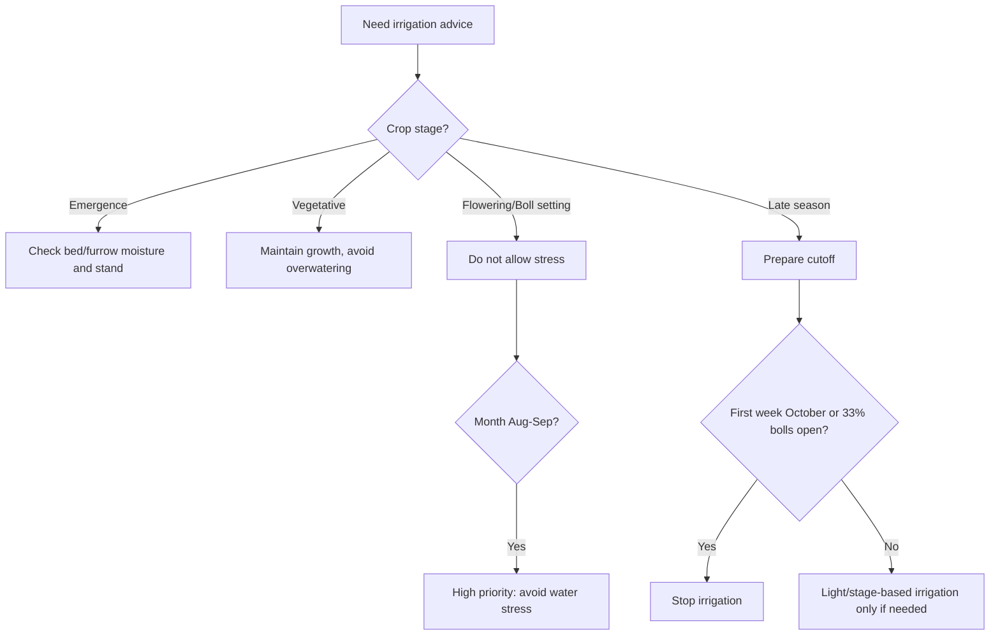

# Cotton Irrigation — Punjab/Pakistan RAG Knowledge File

## Metadata
- Crop: Cotton / Kapaas / Phutti
- Region focus: Punjab, Pakistan
- Primary uploaded source:
  - `ccri_cotton_global_germplasm.txt`
- Supplementary official/local sources:
  - CCRI Multan agronomy guidance
  - CCRI Multan Annual Progress Report 2023–2024
- General international source used for non-local crop-water framing:
  - FAO crop water and crop coefficient guidance

## Executive Summary
Cotton irrigation in Punjab should be stage-based and soil-condition-based. The key local rules are:
- Prefer bed-furrow planting where possible.
- Use laser leveling for uniform irrigation.
- Avoid standing water.
- Avoid water stress from early August to end September.
- Stop final irrigation by the first week of October.
- Do not irrigate after roughly 33% boll opening.
- High-GOT American cotton varieties are especially sensitive to overwatering and late irrigation because maturity and boll opening can be affected.

## General Water Requirement
CCRI local guidance describes cotton in Pakistan as commonly needing around 800–1000 mm water over the crop period. FAO gives a broader general cotton seasonal water requirement of about 700–1300 mm, depending on climate, variety, season length, soil, and management.

## Planting System and Irrigation
### Bed-Furrow System
Recommended where possible because it:
- Saves water.
- Improves drainage.
- Helps germination.
- Reduces rain damage.
- Is useful in saline, alkaline, clayey, or patchy soils.

Local CCRI notes indicate bed-furrow can save around 30–40% irrigation water compared with conventional flat planting.

### Flat Planting
For flat planting, first irrigation is usually around 30–40 days after sowing, depending on variety, soil, crop condition, and weather.

## Irrigation Schedule

| Stage | Approximate Timing | Local Irrigation Guidance |
|---|---|---|
| Sowing/emergence | 0–7 DAS | In bed-furrow, second irrigation at 3–4 DAS may support emergence |
| Early vegetative | 7–30 DAS | Avoid overwatering; maintain good stand |
| First main irrigation in flat planting | 30–40 DAS | First irrigation usually around this window |
| Development stage | 40–80 DAS | Irrigate according to soil/crop need; avoid long dry intervals |
| Flowering and boll setting | Around 80–140 DAS | Highest sensitivity; avoid water stress |
| Peak fruiting window | Often August–September | Do not allow water stress from 1 August to end September |
| Boll filling/opening | Late season | Taper irrigation; avoid standing water |
| Maturity | First week October / 33% boll opening | Stop irrigation |

## Irrigation Intervals
- General CCRI guidance: do not let irrigation intervals exceed 15–21 days under normal conditions.
- Bed-furrow under hot/light-soil conditions may need shorter 8–10 day intervals.
- Exact interval depends on:
  - Soil texture
  - Canal/well water availability
  - Rainfall
  - Crop stage
  - Field leveling
  - Plant vigor
  - Temperature and wind

## Water Stress Identification

| Field Sign | Possible Meaning | Action |
|---|---|---|
| Tight internodes and stressed look | Irrigation interval too long | Irrigate and shorten next interval |
| Flower/boll shedding in August–September | Peak-stage water stress | Correct immediately; avoid repeat stress |
| Fruit shedding after rain/irrigation | Standing water or waterlogging | Drain field quickly |
| Uneven stand | Poor moisture distribution or bed shape | Correct bed/furrow irrigation uniformity |
| Delayed maturity with lush growth | Over-irrigation or excess N | Stop late irrigation and balance crop |

## Waterlogging Warning
Standing water is dangerous. CCRI annual-report guidance notes that standing water even up to 24 hours can contribute to fruit shedding. Correct drainage and field leveling if this occurs.

## Final Irrigation Rule
The uploaded germplasm note and official CCRI guidance align on this:
- Stop final irrigation by the first week of October.
- Do not irrigate once about 33% bolls have opened.
- Late irrigation can delay maturity and reduce high-GOT potential.

## FAO Crop Coefficient Context
Where weather data is available, use the FAO evapotranspiration framework:
- `ETc = Kc × ETo`
- Representative cotton Kc values:
  - Initial: about 0.35
  - Mid-season: about 1.15–1.20
  - Late season: about 0.70–0.50

Use local CCRI irrigation timing first for farmer-facing advice, and FAO Kc values for app-level water estimation models.

## Irrigation Decision Flow

## RAG Response Rules
- Ask or infer planting system: bed-furrow or flat.
- Ask or infer crop stage.
- For Punjab, never recommend late irrigation after first week of October unless a local expert has a specific reason.
- If the user says bolls are rotting or crop is too lush, check over-irrigation and excessive N.
- If the user says flowers/bolls are shedding in August/September, consider water stress or waterlogging depending on field condition.
- Do not give a fixed “every X days” answer without soil/stage context.

## RAG Keywords
cotton irrigation, kapaas pani, cotton water requirement, cotton irrigation schedule Punjab, bed furrow cotton, flat planting cotton irrigation, first irrigation cotton, final irrigation cotton, cotton water stress, cotton waterlogging, cotton boll shedding, stop irrigation cotton October, FAO cotton water

## Source Notes
Uploaded germplasm material provided warnings about overwatering and final watering for high-GOT varieties. Local irrigation details came from official CCRI Multan agronomy and annual-report guidance. FAO was used only for general crop-water and Kc framework.
