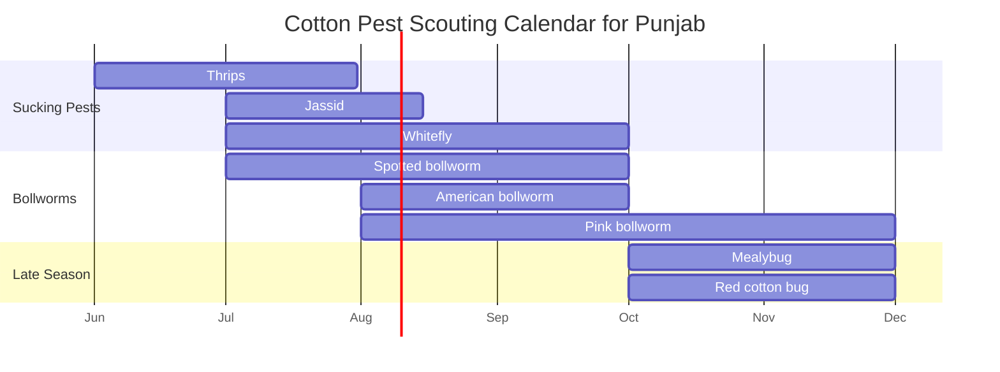

# Cotton Pests — Punjab/Pakistan RAG Knowledge File

## Metadata
- Crop: Cotton / Kapaas / Phutti
- Region focus: Punjab, Pakistan
- Primary uploaded sources:
  - `cotton_ccri_clcuv_research.txt`
  - `ccri_cotton_global_germplasm.txt`
  - `cotton_ccri_diseases_base.txt`
- Supplementary official/local sources:
  - CCRI Multan entomology guidance
  - CCRI Multan Annual Progress Report 2023–2024

## Executive Summary
Cotton pest management in Punjab should be threshold-based, not calendar-based. The most important local pests include thrips, jassid, whitefly, mealybug, red cotton bug, dusky cotton bug, mites, pink bollworm, spotted bollworm, American bollworm, and armyworm.

Whitefly is especially important because it directly transmits Cotton Leaf Curl Virus/Disease (CLCuV/CLCuD). Pink bollworm is a major late-season and carryover threat, especially where Bt cotton efficacy is declining. Good IPM requires scouting, ETL-based spray decisions, preservation of natural enemies, and strict crop-residue sanitation after picking.

## Major Pests and Identification

| Pest | Local/Common Name | Main Symptoms | Main Local Window | ETL / Action Trigger |
|---|---|---|---|---|
| Thrips | Thrips | Wrinkled/distorted seedling leaves, white shiny patches, rusty appearance | June–July | 10 adults/nymphs per leaf |
| Jassid | Tila/jassid | Downward leaf curling, yellowing/browning, hopper burn, stunting | July | 1 adult/nymph per leaf |
| Whitefly | Safaid makkhi | Leaf weakness, honeydew, sooty mould, CLCuD spread | July–September; critical mid-June to end-August | 5 adults/nymphs or both per leaf |
| Pink bollworm | Gulabi sundi | Rosetted flowers, hidden larval feeding inside bolls | August–November | 5% boll damage |
| Spotted bollworm | Spotted bollworm | Dried shoots, holes in buds/bolls, frass | July–September | 3 larvae per 25 plants |
| American bollworm | American bollworm | Damaged squares/bolls, holes near base, bract flaring | August–October | 5 brown eggs or 3 larvae, or 5 collectively per 25 plants |
| Armyworm | Lashkari sundi | Leaf skeletonization and defoliation | Variable | On appearance |
| Mealybug | Mealybug | Cottony clusters, weak growth, honeydew | Often late season | Scout and control early colonies |
| Red cotton bug | Red cotton bug | Damage to developing/open bolls and seed | October–November | Monitor late crop and picking hygiene |
| Dusky cotton bug | Dusky cotton bug | Seed/lint contamination and quality loss | Late season | Harvest/picking hygiene |
| Mites | Mites | Bronzing, webbing, leaf drying under hot/dry stress | Variable | Monitor hotspots |

## Local Pest Seasonality

## Whitefly and CLCuD Link
Whitefly (`Bemisia tabaci`) spreads Cotton Leaf Curl Virus. In CLCuD-prone systems, whitefly is not just a pest problem; it is also a disease-vector problem.

### Whitefly Risk Signals
- White insects flying from underside of leaves.
- Nymphs on underside of leaves.
- Sticky honeydew.
- Black sooty mould.
- Leaf curling and vein thickening when CLCuD develops.

### Whitefly Management
- Scout from early crop stage.
- Suppress whitefly especially from mid-June to end-August.
- Remove weeds, volunteer cotton, off-season okra, and alternate malvaceous hosts.
- Avoid excessive nitrogen that produces lush, attractive growth.
- Use ETL-based decisions, not blind sprays.

## Pink Bollworm Management
Pink bollworm is a major late-season and carryover threat.

### Signs
- Rosetted flowers.
- Larvae inside bolls.
- Damaged seed and lint.
- Poor boll opening.
- Hidden damage that may not be obvious externally.

### Management
- Do not plant Bt cotton before the locally advised window.
- Plant 10% non-Bt refuge with Bt cotton where recommended.
- After last picking, graze or remove leftover bolls.
- Shred/incorporate cotton sticks where possible.
- If sticks are kept for fuel, bundle them with tops toward the sun and use before mid-February.
- Do not leave unopened/damaged bolls in the field.

## Natural Enemies
Preserve beneficial insects where possible:
- Green lacewing
- Ladybird beetles
- Spiders
- `Eretmocerus` parasitoids against whitefly
- `Aenasius bambawalei` against mealybug
- `Trichogramma chilonis` against bollworms
- Syrphids and anthocorid bugs against aphids

Avoid unnecessary early sprays because they can kill beneficial insects and trigger pest resurgence.

## IPM Rules for RAG
1. Always ask/identify crop stage before recommending pest action.
2. Recommend scouting first unless the user already reports pest count above ETL.
3. Use ETL thresholds:
   - Jassid: 1 adult/nymph per leaf.
   - Whitefly: 5 adults/nymphs or both per leaf.
   - Thrips: 10 adults/nymphs per leaf.
   - Spotted bollworm: 3 larvae per 25 plants.
   - Pink bollworm: 5% boll damage.
   - American bollworm: 5 brown eggs or 3 larvae, or collectively 5 per 25 plants.
   - Armyworm: action on appearance.
4. Mention that exact pesticide choice must follow current local registration/label.
5. Do not recommend repeated blind sprays.
6. For CLCuD symptoms, combine disease guidance with whitefly control and host sanitation.

## Treatment Notes
Official CCRI pest pages list several active ingredients for different pests, but pesticide registration, brand availability, PHI, and resistance guidance can change. For safety and accuracy, this file keeps chemical recommendations general:
- Confirm current Punjab/Pakistan label before purchase.
- Rotate mode of action.
- Do not overuse pyrethroids early.
- Use IGRs where whitefly nymphs are the target.
- Re-scout 3–4 days after spray to judge effectiveness.

## RAG Keywords
cotton pests, kapaas pests, phutti pests, whitefly, safaid makkhi, CLCuV vector, jassid, tila, thrips, pink bollworm, gulabi sundi, spotted bollworm, American bollworm, armyworm, mealybug, red cotton bug, dusky cotton bug, mites, cotton ETL, cotton IPM Punjab

## Source Notes
Primary disease-vector and cultivar-risk information comes from uploaded CCRI files. Pest identity, ETLs, seasonality, natural enemies, and IPM framework are filled from official CCRI Multan entomology and annual-report material.
