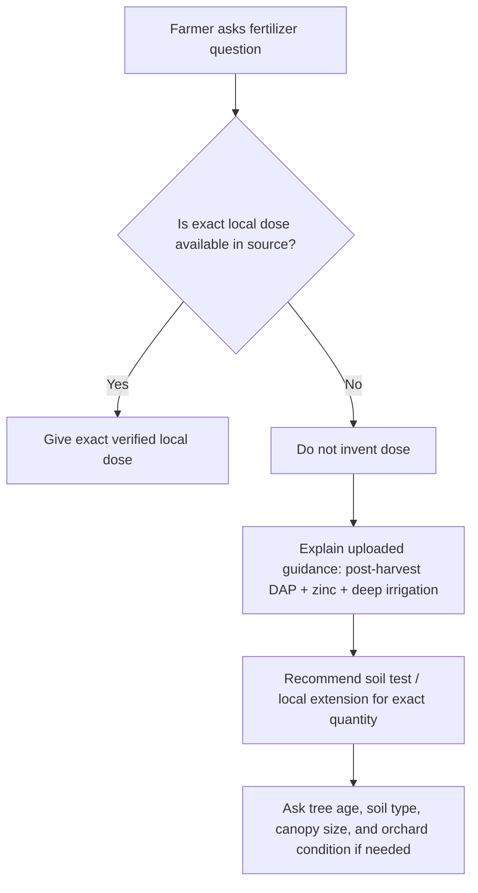

<!--
FarmAI / KISAAN AI Mango Knowledge File
Primary source: Uploaded mango_mrs_master.txt
Local context: Mango / Aam / آم in Punjab & South Punjab, Pakistan
Core institutional source stated in upload: Mango Research Station (MRS) Multan / Ayub Agricultural Research Institute (AARI)

Important safety note:
- Pesticide/fungicide recommendations must be checked against current product labels, local extension advice, PHI/pre-harvest intervals, and MRL/export requirements.
- Do not spray during full bloom unless absolutely necessary, because pollinators may be harmed.
- Use protective equipment and avoid drift, overdose, and mixing incompatible products.
-->

# Mango Fertilizer and Nutrition — Punjab / South Punjab

## Purpose

This file is for a FarmAI/KISAAN AI RAG knowledge base. It summarizes mango fertilizer and nutrition guidance available from the uploaded MRS Multan/AARI master directive.

Important limitation: the uploaded file gives only limited fertilizer details. It does **not** provide complete age-wise or per-tree fertilizer dose schedules. Therefore, this file does not invent exact NPK rates.

---

## 1. Locally Available Fertilizer Guidance from Uploaded Source

The uploaded local source gives this key instruction:

- After final fruit harvest and pruning, usually in **July/August**, resume regular deep basin irrigation.
- Apply a balanced dose of **Phosphorus through DAP** and **Zinc fertilizer**.
- This supports next year’s internal fruit bud differentiation.

### Why this timing matters

Post-harvest is the recovery and bud-differentiation window. After fruit removal and pruning, the tree needs water and nutrition to rebuild reserves for the next season.

---

## 2. What Is Not Available in the Uploaded File

The uploaded source does **not** provide:

- exact DAP dose per tree
- exact zinc dose per tree
- age-wise fertilizer table
- FYM/organic manure quantity
- nitrogen/potash schedule
- soil test interpretation
- foliar zinc concentration
- deficiency correction rates

FarmAI should avoid giving exact fertilizer quantities unless a verified Punjab/Pakistan official source is added later.

---

## 3. Safe RAG Behavior for Fertilizer Questions

When the farmer asks for fertilizer doses and the local source is incomplete, FarmAI should answer carefully:

1. Mention that the local MRS/AARI upload specifically recommends post-harvest DAP and zinc with deep irrigation.
2. Do not invent per-tree or per-acre rates.
3. Recommend soil testing or local agriculture extension guidance for exact dose.
4. Ask for tree age, canopy size, soil type, previous fertilizer use, and yield level if personalized advice is needed.
5. Warn against heavy fertilizer and irrigation before flowering because it can trigger vegetative flushing.

---

## 4. Post-Harvest Nutrition Window

### Timing

- After final harvest
- After pruning
- Usually July/August in Punjab/South Punjab mango production

### Local recommendation

- Resume regular deep basin irrigation
- Apply balanced phosphorus through DAP
- Apply zinc fertilizer

### Expected purpose

- Tree recovery
- New flush support
- Bud differentiation for next year
- Improved orchard vigor

---

## 5. Link Between Irrigation and Fertilizer

Fertilizer guidance in the upload is connected with irrigation timing.

### Before flowering

Irrigation is stopped from late November/December until fruit-set. During this time, avoid fertilizer and water practices that push strong vegetative flush.

### After harvest

Deep basin irrigation is resumed and paired with DAP + zinc.

---

## 6. Practical Farmer Advice

### If farmer asks: “Mango ko kaunsi khaad doon?”

Answer:

For Punjab mango, the uploaded MRS/AARI guidance clearly mentions post-harvest nutrition. After harvest and pruning in July/August, restart deep basin irrigation and apply balanced DAP for phosphorus plus zinc fertilizer. Exact dose depends on tree age, soil test, and orchard condition, so do not apply random heavy fertilizer. Avoid pushing vegetative growth before flowering.

### If farmer asks: “Flowering se pehle khaad doon?”

Answer:

Be careful before flowering. Local guidance says irrigation should be stopped from late November/December until fruit-set, because water at flowering can push vegetative flush and cause boor drop. Fertilizer before flowering should not be used blindly. Use local soil test or extension advice.

### If farmer asks: “Zinc kab dena hai?”

Answer:

The uploaded local guidance specifically mentions zinc after harvest along with DAP and deep basin irrigation. This helps tree recovery and next year’s bud differentiation. Exact zinc dose is not given in the upload, so it should be based on local recommendation or soil/leaf analysis.

---

## 7. RAG Query Triggers

Use this file when the farmer mentions:

- mango fertilizer
- aam ki khaad
- DAP for mango
- zinc for mango
- harvest ke baad khaad
- mango nutrition
- fruit bud differentiation
- khaad kab deni hai
- flowering se pehle fertilizer
- mango tree weak hai
- mango leaves small or pale

---

## 8. Decision Flow

---

## Source

- Uploaded file: `mango_mrs_master.txt`
- Stated institutional source inside upload: Mango Research Station Multan / Ayub Agricultural Research Institute (AARI)
