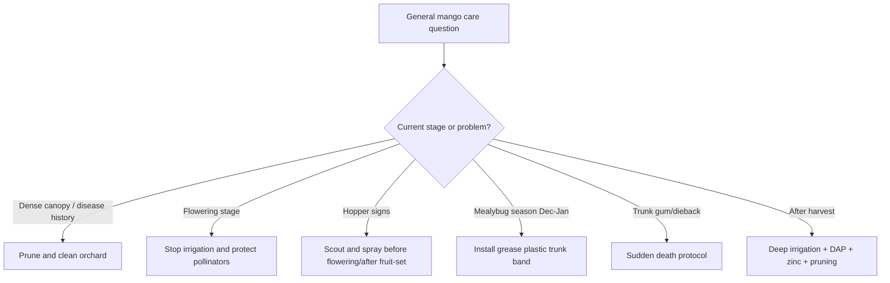

<!--
FarmAI / KISAAN AI Mango Knowledge File
Primary source: Uploaded mango_mrs_master.txt
Local context: Mango / Aam / آم in Punjab & South Punjab, Pakistan
Core institutional source stated in upload: Mango Research Station (MRS) Multan / Ayub Agricultural Research Institute (AARI)

Important safety note:
- Pesticide/fungicide recommendations must be checked against current product labels, local extension advice, PHI/pre-harvest intervals, and MRL/export requirements.
- Do not spray during full bloom unless absolutely necessary, because pollinators may be harmed.
- Use protective equipment and avoid drift, overdose, and mixing incompatible products.
-->

# Mango General Care — Punjab / South Punjab

## Purpose

This file is for a FarmAI/KISAAN AI RAG knowledge base. It combines general mango orchard care practices from the uploaded MRS Multan/AARI master directive, especially disease prevention, pest prevention, irrigation discipline, pruning, sanitation, and cultivar risk.

---

## 1. Core Orchard Care Principles

### Keep canopy open

Dense un-pruned canopies increase internal humidity and help anthracnose spores survive. Pruning and canopy opening reduce disease pressure.

FarmAI should prioritize canopy clearance if the farmer reports:

- ghani jhariyan
- dense canopy
- overlapping branches
- no pruning
- poor airflow
- repeated anthracnose

### Keep orchard floor clean

Remove:

- fallen leaves
- diseased debris
- dead twigs
- infected branches
- rotting fruit
- material that shelters pests

This reduces overwintering spores and pest survival.

### Protect flowering

During flowering:

- avoid irrigation until fruit-set
- avoid unnecessary spraying during full bloom
- protect honeybees
- scout hopper carefully
- prevent boor drop

### Treat wounds quickly

After pruning diseased branches:

- paint cut surfaces
- use Bordeaux paste or Copper Oxychloride paste
- do not leave open wounds untreated

---

## 2. Seasonal Care Calendar

| Time / Stage | Care action | Main purpose |
|---|---|---|
| Late November/December to fruit-set | Stop irrigation | Prevent vegetative flush and boor drop |
| Pre-flowering bud stage | Begin protective disease/pest scouting and spray only when needed | Prevent anthracnose and hopper damage |
| Full bloom | Avoid routine insecticides | Protect honeybees and pollination |
| Mung-dana stage | Resume care after fruit-set; hopper second spray if needed | Protect young fruit |
| Monsoon / humid weather | Watch for anthracnose | High humidity and rain increase risk |
| July/August after harvest | Prune, deep irrigate, apply DAP + zinc | Recovery and next year bud differentiation |
| December–January | Install mealybug trunk band | Stop nymphs from climbing |

---

## 3. Variety-Based Care Priority

### High-priority varieties

- Anwar Ratol
- Chaunsa, including White, Summer, and Black Chaunsa

These need extra care against:

- anthracnose
- blossom blight
- mango sudden death

### Relatively tolerant varieties

- Sindhri
- Dusehri

These still require normal care, but the upload describes them as more tolerant against sudden death bark vectors and post-harvest skin spotting.

---

## 4. General Disease Prevention

To reduce anthracnose:

- prune dense canopy
- remove fallen infected leaves
- avoid moisture buildup
- start protective sprays at budburst if risk is high
- repeat at 14-day intervals if monsoon rains persist
- avoid systemic sprays within 14–21 days of harvest

To reduce sudden death:

- monitor trunk and branches for gum oozing
- watch for bark darkening and cracks
- prune infected branches 6 inches below dead wood
- paint wounds with Bordeaux or copper paste
- drench trunk/soil where recommended
- remove infected wood from orchard

---

## 5. General Pest Prevention

To reduce hopper:

- scout during February/March flowering
- inspect panicles and bark crevices
- avoid full-bloom sprays unless severe
- spray before flowering and after fruit-set if needed

To reduce mealybug:

- install grease-coated plastic trunk bands in December–January
- keep bands 12–18 inches wide
- place around 3 feet above ground
- remove weeds and soil bridges that let insects bypass the band
- use chemical rescue only after insects reach canopy

---

## 6. General Irrigation and Nutrition Care

### Irrigation

- Stop irrigation from late November/December to fruit-set
- Resume deep basin irrigation after harvest and pruning
- Avoid waterlogging during humid/rainy periods

### Nutrition

- Apply balanced DAP and zinc after harvest with deep basin irrigation
- Do not invent exact fertilizer rates if they are not available
- Use soil testing or local expert advice for exact dose

---

## 7. RAG Query Triggers

Use this file when the farmer asks broad questions like:

- aam ke bagh ki dekh bhaal
- mango general care
- mango orchard management
- aam ka bagh kaise sambhalen
- chaunsa care
- anwar ratol care
- mango pruning
- mango sanitation
- mango flowering care
- mango post-harvest care
- mango yearly calendar

---

## 8. Short Farmer Advice Template

For Punjab mango orchards, the most important care steps are: keep the canopy open, remove infected debris, stop irrigation from late November/December until fruit-set, avoid unnecessary sprays during full bloom, use hopper sprays before flowering and after fruit-set if needed, install mealybug grease bands in December–January, and after harvest/pruning resume deep basin irrigation with DAP and zinc. Anwar Ratol and Chaunsa need extra disease scouting.

---

## 9. Decision Flow

---

## Source

- Uploaded file: `mango_mrs_master.txt`
- Stated institutional source inside upload: Mango Research Station Multan / Ayub Agricultural Research Institute (AARI)
