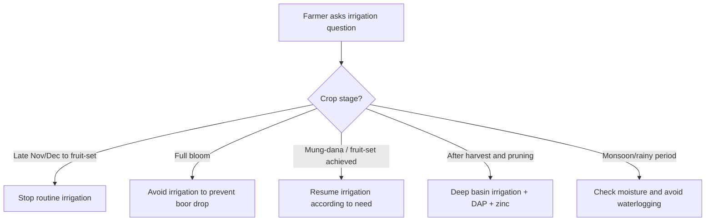

<!--
FarmAI / KISAAN AI Mango Knowledge File
Primary source: Uploaded mango_mrs_master.txt
Local context: Mango / Aam / آم in Punjab & South Punjab, Pakistan
Core institutional source stated in upload: Mango Research Station (MRS) Multan / Ayub Agricultural Research Institute (AARI)

Important safety note:
- Pesticide/fungicide recommendations must be checked against current product labels, local extension advice, PHI/pre-harvest intervals, and MRL/export requirements.
- Do not spray during full bloom unless absolutely necessary, because pollinators may be harmed.
- Use protective equipment and avoid drift, overdose, and mixing incompatible products.
-->

# Mango Irrigation Management — Punjab / South Punjab

## Purpose

This file is for a FarmAI/KISAAN AI RAG knowledge base. It summarizes mango irrigation timing and water-management rules for Punjab and South Punjab using the uploaded MRS Multan/AARI master directive as the primary source.

---

## 1. Critical Flowering Irrigation Rule

### Main rule

Completely stop all irrigation cycles from **late November/December until full fruit-set is achieved in spring**, also described as the **mung-dana stage**.

### Why irrigation is stopped

Water during full bloom can trigger excessive vegetative flushing, locally described as:

- naye patte nikalna
- vegetative flush
- unnecessary new leaf growth

This can cause:

- boor girna / flower drop
- poor fruit-set
- total yield failure in severe cases

### FarmAI action rule

If the farmer is asking during flowering or before fruit-set, do not recommend routine irrigation unless there is severe stress and local expert guidance supports emergency watering.

---

## 2. Post-Harvest Irrigation Rule

### Timing

- After final fruit harvest
- After pruning
- Usually July/August

### Recommendation

Resume regular deep basin irrigation immediately after harvest and pruning.

### Combine with nutrition

Post-harvest irrigation should be paired with:

- balanced phosphorus through DAP
- zinc fertilizer

### Purpose

This helps:

- tree recovery
- next year’s internal fruit bud differentiation
- orchard vigor after fruit load

---

## 3. Stage-Wise Irrigation Table

| Stage | Irrigation recommendation | Reason |
|---|---|---|
| Late November/December to fruit-set | Stop irrigation | Prevent vegetative flush and flower drop |
| Full bloom | Avoid irrigation | Prevent boor drop and poor fruit-set |
| Mung-dana / full fruit-set stage | Irrigation can resume according to need | Fruit has set and tree water demand increases |
| After final harvest and pruning | Resume deep basin irrigation | Tree recovery and next year bud differentiation |
| Monsoon / high humidity period | Avoid waterlogging | High humidity and moisture increase disease pressure |

---

## 4. Disease Link

Irrigation and disease are linked because excessive moisture and dense canopies raise humidity.

For anthracnose risk:

- high humidity
- rainfall
- dense canopy
- wet orchard floor

all increase disease pressure.

Therefore:

- avoid unnecessary wetness inside canopy
- prune for airflow
- remove fallen leaf litter
- do not allow waterlogging

---

## 5. Practical Farmer Advice

### If farmer asks: “Flowering mein pani doon?”

Answer:

No, routine irrigation should be stopped from late November/December until fruit-set. Giving water during flowering can push new leaves and cause boor drop. Wait until fruit-set or mung-dana stage unless the tree is under severe stress and local expert advice says otherwise.

### If farmer asks: “Harvest ke baad pani kab dena hai?”

Answer:

After final harvest and pruning, restart regular deep basin irrigation. The uploaded local guidance also recommends applying DAP and zinc at this stage to support next year’s fruit bud differentiation.

### If farmer asks: “Barish ke baad pani doon?”

Answer:

Do not irrigate blindly after rain. High moisture and humidity can increase anthracnose risk, especially in dense canopies. Check soil moisture and avoid waterlogging.

---

## 6. RAG Query Triggers

Use this file when the farmer mentions:

- mango irrigation
- aam ko pani kab dena hai
- flowering mein pani
- boor ke time pani
- fruit set irrigation
- mung dana stage
- harvest ke baad pani
- deep basin irrigation
- waterlogging
- monsoon irrigation
- mango flower drop after irrigation

---

## 7. Decision Flow

---

## Source

- Uploaded file: `mango_mrs_master.txt`
- Stated institutional source inside upload: Mango Research Station Multan / Ayub Agricultural Research Institute (AARI)
