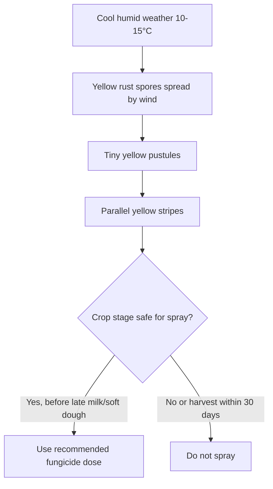

<!--
Primary source policy:
- Built from user-uploaded wheat source files only.
- Where uploaded files do not provide a detail, the file marks it as a gap instead of guessing.
- Local Punjab/South Punjab figures, dosages, timings and thresholds are taken only from the uploaded AARI/Ziratnama/Punjab notes.
-->

# Wheat Diseases — Punjab / South Punjab

## Executive Summary

This file covers the wheat diseases that are explicitly available in the uploaded local source material:

1. **Yellow Rust / Stripe Rust** — locally called *Peeli Kungi*, *Kungi ka hamla*, *Peeliya*, *Haldi numa powder*.
2. **Loose Smut** — locally called *Kani*, *Kaali Kungi*, *Sittay ka koyla banna*.

The uploaded material gives detailed local action rules for yellow rust and seed-treatment prevention for loose smut. It does **not** provide a full Punjab wheat disease registry for all possible diseases, so this file does not invent unsupported diseases.

---

## 1. Yellow Rust / Stripe Rust

| Field | Details |
|---|---|
| Local names | Peeli Kungi, Kungi ka hamla, Peeliya, Stripe Rust, Haldi numa powder, پیلی کنگی |
| Pathogen | *Puccinia striiformis* f. sp. *tritici* |
| High-risk weather | Cool and humid weather |
| Extreme risk temperature | **10°C to 15°C** with high humidity and leaf wetness |
| Main risk window | Late January, February, March |
| Spread | Wind-borne spores moving from northern hilly areas into Punjab plains |

### Visual Identification

- Tiny lemon-yellow pustules on wheat leaves.
- Long parallel yellow stripes running along leaf veins.
- Yellow powder stains the fingers when the leaf is rubbed.
- Severe infection dries leaves and may reduce grain size.

### When to Treat

Treat only after field verification. The uploaded local source recommends immediate systemic fungicide treatment when parallel yellow stripes cover more than **1% of canopy area**.

### Chemical Options Per Acre

| Option | Active / Product | Dose | Water |
|---|---:|---:|---:|
| A | Nativo 75 WG | 65 g / acre | 100–120 L |
| B | Tilt 250 EC | 200 ml / acre | 100 L |
| C | Amistar Top | 200 ml / acre | Not specified in upload |

### Important Safety Rules

- If 3-day weather forecast shows temperature rising above **22°C–25°C** with dry winds, emergency spray should be downgraded because the disease is less able to sustain under dry heat.
- Do **not** spray fungicide if crop has crossed late milk / soft dough stage or is within **30 days of harvest**.

---

## 2. Loose Smut

| Field | Details |
|---|---|
| Local names | Kani, Kaali kungi, Sittay ka koyla banna, کانی |
| Pathogen | *Ustilago nuda* f. sp. *tritici* |
| Visible stage | Heading / earing stage |

### Visual Identification

- Infected ear turns into black soot-like powder.
- Spikelets look like black powdery mass.
- A thin silvery membrane may cover the black mass at first, then ruptures.
- Later only a naked dark central axis remains.

### Management

- Chemical spray during active flowering breakout is useless.
- Mark infected field location for next season.
- Before sowing next season, use seed dressing:

| Treatment | Dose |
|---|---:|
| Tebuzil or Vitavax | 2 g per 1 kg seed |

---

## Resistant / Susceptible Variety Notes

### Approved / resistant varieties mentioned in uploaded source

- Akbar-2019
- Dilkash-2020
- Bhakkar-Star
- Subhani-2021
- MH-2021
- Faisalabad-2008

If a farmer has repeated yellow rust history, the uploaded source specifically says future seed choice should shift toward **Dilkash-2020** or **Akbar-2019**.

### Highly susceptible / old varieties mentioned in uploaded source

- Seher-2006
- Galaxy-2013
- Inqalab-91

If these varieties are still being used, yellow rust risk should be treated as much higher.

---

## Mermaid Diagram

---

## Data Gaps

The uploaded files do not provide full local guidance for all wheat diseases such as brown rust, black rust, powdery mildew, karnal bunt, root rot, or leaf blight. Do not add local chemical recommendations for those without a verified Punjab/Pakistan source.

---

## Sources Used

1. User-uploaded `wheat_aari_diseases.txt` — AARI / Directorate of Extension Punjab wheat disease directive.
