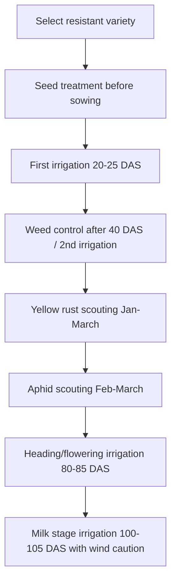

<!--
Primary source policy:
- Built from user-uploaded wheat source files only.
- Where uploaded files do not provide a detail, the file marks it as a gap instead of guessing.
- Local Punjab/South Punjab figures, dosages, timings and thresholds are taken only from the uploaded AARI/Ziratnama/Punjab notes.
-->

# Wheat General Care — Punjab / South Punjab

## Executive Summary

This file combines the uploaded local wheat guidance into one season-long care plan for FarmAI. It includes disease scouting, aphid monitoring, irrigation timing, weed control, seed treatment, variety notes, and spray safety rules.

---

## 1. Variety Selection

### Approved / strong varieties mentioned

- Akbar-2019
- Dilkash-2020
- Bhakkar-Star
- Subhani-2021
- MH-2021
- Faisalabad-2008

For areas with repeated yellow rust history, prefer **Dilkash-2020** or **Akbar-2019** according to the uploaded local directive.

### Avoid / high-risk old varieties mentioned

- Seher-2006
- Galaxy-2013
- Inqalab-91

These should raise baseline yellow rust risk.

---

## 2. Seed Treatment

Loose smut cannot be controlled effectively after visible outbreak at heading stage. Prevention is seed treatment before sowing.

| Purpose | Treatment | Dose |
|---|---|---:|
| Loose smut prevention | Tebuzil or Vitavax | 2 g per 1 kg seed |

---

## 3. Irrigation Care Calendar

| Stage | Time after sowing | Care action |
|---|---:|---|
| Tillering / CRI | 20–25 days | First irrigation; most important for spike count |
| Jointing / booting | 55–60 days | Maintain soil moisture |
| Heading / flowering | 80–85 days | Avoid water stress to protect grain count |
| Milk / soft dough | 100–105 days | Support grain size; avoid irrigation in strong wind |

---

## 4. Disease Scouting

### Yellow rust scouting

Scout especially in late January, February, and March, especially after rain, dew, cool humid weather, and 10°C–15°C temperature.

Look for:

- Yellow pustules
- Parallel yellow stripes
- Yellow powder on fingers after rubbing leaf

Spray only if crop stage and weather rules allow.

### Loose smut scouting

Look at heading stage for black powdery ears. Do not spray active outbreak; record field and treat seed next season.

---

## 5. Pest Scouting

### Aphid

Risk period: late February to March.

Check:

- Ears/sitta
- Underside of leaves
- Sticky honeydew
- Black sooty mold
- Yellowing leaves

Spray threshold: more than **15 aphids per ear/sitta** before milk stage.

---

## 6. Weed Management

Unchecked weeds can cause up to **42% yield loss** according to the uploaded weed-management source.

### Weed groups

| Group | Examples |
|---|---|
| Narrow-leaf weeds | Wild oats / Jangli Jai, Canary grass / Dumbi Sitti |
| Broad-leaf weeds | Bathu, Lehli, Karund, Rewari, Senji, Gajar Booti, Shahtra, Jangli Palak, etc. |

### Spray timing

- Narrow-leaf weed herbicides: 40 days after sowing or after 2nd irrigation when weeds have germinated and field has proper moisture condition.
- Do not spray during strong wind, heavy fog, or rain.
- Use T-Jet or Flat-Fan nozzle.
- Do not double-spray the same row and do not leave gaps.

---

## 7. Herbicide Quick Table

### Narrow-leaf weeds

| Chemical | Dose per acre |
|---|---:|
| Clodinafop-propargyl 15% WP | 120 g |
| Fenoxaprop-p-ethyl | 500 ml |
| Pinoxaden | 330 ml |
| Tralkoxydim + Fenoxaprop-p-ethyl + Clodinafop | 500 ml |
| Sulfosulfuron 75% WG | 13.5 g |

### Broad-leaf weeds

| Chemical | Dose per acre |
|---|---:|
| Triasulfuron 75% WG | 16 g |
| Bromoxynil + MCPA EC | 300 ml |
| Fluroxypyr-meptyl + MCPA 50% EC | 375 ml |
| Florasulam + Aminopyralid 45% | 12.5 g |
| Metsulfuron-methyl + Tribenuron-methyl 28.6% | 14 g |
| Carfentrazone-ethyl 40% DF | 20 g |

### Combination herbicides

| Chemical | Dose per acre |
|---|---:|
| Oxadiargyl + Carfentrazone-ethyl 50% WP | 800 g |
| Mesosulfuron-methyl + Iodosulfuron | 100 g |
| Pyroxsulam 45% OD | 150 ml |
| Pinoxaden + Fluroxypyr + MCPA Isooctyl | 300 ml |

---

## 8. General Spray Safety

- Do not spray in strong wind.
- Do not spray in rain.
- Do not spray in heavy fog.
- Use correct nozzle.
- Avoid repeated/double spray on same row.
- Follow pre-harvest cutoff for fungicides.

---

## Mermaid Season Flow

---

## Sources Used

1. User-uploaded `wheat_aari_diseases.txt` — diseases, aphid, varieties, seed treatment, irrigation timing.
2. User-uploaded `wheat_ziratnama_irrigation.txt` — climate-stress and water-management rules.
3. User-uploaded `wheat_ziratnama_weeds.txt` — weed classification, herbicide timing, spray rules, and doses.
