<!--
Primary source policy:
- Built from user-uploaded wheat source files only.
- Where uploaded files do not provide a detail, the file marks it as a gap instead of guessing.
- Local Punjab/South Punjab figures, dosages, timings and thresholds are taken only from the uploaded AARI/Ziratnama/Punjab notes.
-->

# Wheat Irrigation — Punjab / South Punjab

## Executive Summary

The uploaded local sources give a clear wheat irrigation schedule for South Punjab clay-loam plains. Standard wheat crop requires **4 to 5 timed irrigations**, with the first four critical windows listed below.

---

## Critical Irrigation Schedule

| Irrigation | Stage | Timing after sowing | Purpose |
|---|---|---:|---|
| 1st | Crown Root Initiation / tillering / shagofay nikalna | 20–25 days | Foundation of tillering; missing it permanently reduces spike count |
| 2nd | Booting / jointing / jorr ban-na | 55–60 days | Supports stem elongation and crop structure |
| 3rd | Heading / flowering / baali nikalna | 80–85 days | Prevents spikelet abortion and protects grain count |
| 4th | Milking / soft dough / daane mein doodh | 100–105 days | Improves grain size and grain weight |

---

## Climate Stress Rules

### Short winter problem

Shorter winter duration can reduce early vegetative growth and tillering, which directly lowers spike count per acre.

### Heat wave problem

Sudden temperature spikes during March and April can shorten grain filling and cause grain shrinkage.

### Heat stress action

If localized heat stress occurs during late grain filling, use short-duration timely irrigation to reduce canopy temperature and limit kernel shriveling.

---

## Lodging Safety Rule

During milk stage, if strong wind warnings are active, delay irrigation. Wet soil plus heavy grain ears can cause lodging/fasal girna.

---

## Laser Land Leveling

Laser land leveling is strongly recommended in the uploaded irrigation source. It can reduce water requirement by **20%–25%** by improving water distribution uniformity.

---

## Mermaid Timeline

```mermaid
gantt
    title Wheat Irrigation Timeline After Sowing
    dateFormat  X
    axisFormat  Day %s
    section Irrigation
    1st irrigation - CRI/tillering :20, 5
    2nd irrigation - jointing      :55, 5
    3rd irrigation - heading       :80, 5
    4th irrigation - milk stage    :100, 5
```

---

## FarmAI Rules

- If crop age is 20–25 days and moisture is low, prioritize first irrigation.
- If crop age is 55–60 days, ask about jointing/booting and soil moisture.
- If crop age is 80–85 days, warn that flowering moisture stress can lower grain count.
- If crop age is 100–105 days, support grain filling but check wind forecast first.
- If field is uneven, recommend laser land leveling for future field preparation.

---

## Sources Used

1. User-uploaded `wheat_aari_diseases.txt` — South Punjab irrigation timing rules.
2. User-uploaded `wheat_ziratnama_irrigation.txt` — climate-stress, heat-wave, and laser-leveling rules.
