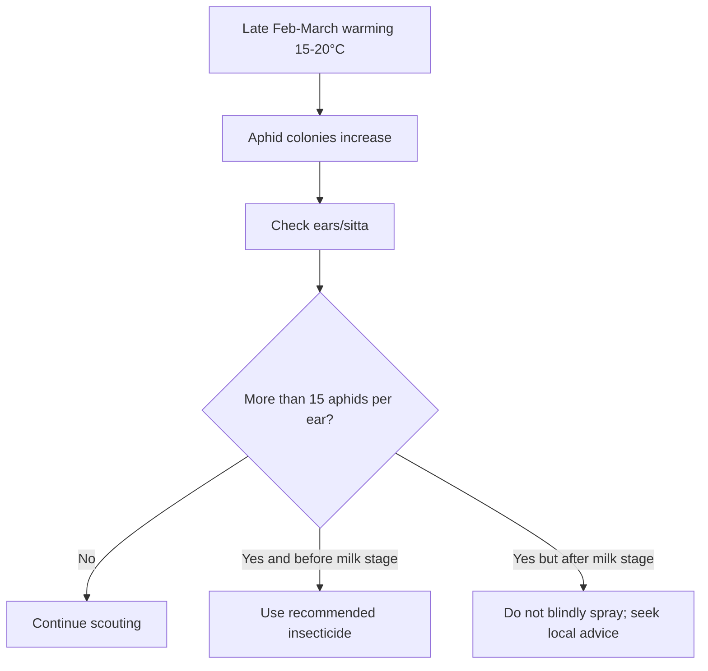

<!--
Primary source policy:
- Built from user-uploaded wheat source files only.
- Where uploaded files do not provide a detail, the file marks it as a gap instead of guessing.
- Local Punjab/South Punjab figures, dosages, timings and thresholds are taken only from the uploaded AARI/Ziratnama/Punjab notes.
-->

# Wheat Pests — Punjab / South Punjab

## Executive Summary

The uploaded local source gives one complete pest profile for wheat: **wheat aphid**, locally called *Sust Tila*, *Kala Tila*, or *Harra Keera*. This file therefore focuses on aphid and does not invent unverified local thresholds for other pests.

---

## Wheat Aphid

| Field | Details |
|---|---|
| Local names | Sust Tila, Kala tila, Harra keera, Aphid hamla, سست تیلا, ہرا تیلا |
| Main risk window | Late February through March |
| Temperature range | 15°C–20°C |
| Major trigger | Excess nitrogen fertilizer causing soft sap-rich canopy |
| Economic threshold | 15 aphids per ear/sitta before milk stage |

### Visual Identification

- Small green, brown, or black soft-bodied insects.
- Found on soft green wheat ears and underside of leaves.
- Leaves may turn yellow due to sap sucking.
- Sticky honeydew / sweet secretion may appear.
- Sooty mold can turn ears black.
- Developing grains may remain small or shriveled.

---

## Treatment Trigger

Spray only if:

1. Aphid population crosses **15 aphids per ear/sitta**, and
2. Crop is still before milk stage.

---

## Chemical Options Per Acre

| Option | Chemical | Dose | Water |
|---|---:|---:|---:|
| A | Imidacloprid 25% WP | 250 g / acre | 100 L |
| B | Thiamethoxam 25% WG | 24 g / acre | Not specified in upload |
| C | Acetamiprid 20% SP | 150 g / acre | Not specified in upload |

---

## Prevention / Risk Reduction

- Avoid excessive nitrogen fertilizer.
- Scout more often from late February to March.
- Check ears and undersides of leaves.
- Do not spray blindly below threshold.

---

## Mermaid Diagram

---

## Data Gaps

The uploaded files do not provide local confirmed thresholds or chemical doses for armyworm, termite, shoot fly, jassid, or other possible wheat pests. Those should only be added after verified Punjab/Pakistan official sources are available.

---

## Sources Used

1. User-uploaded `wheat_aari_diseases.txt` — AARI / Directorate of Extension Punjab pest profile for wheat aphid.
